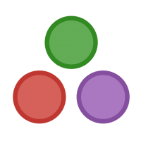

  

 <h1>Julia CluBR</h1> 

 <h1>Código de Conduta
</h1> 

O Julia CluBR segue o código de conduta da comunidade Julia, que se compromete em manter um ambiente acolhedor, civilizado e construtivo. Esperamos que os seguintes padrões sejam observados e mantidos por todos os participantes em qualquer fórum ou evento da comunidade.

## Seja respeitoso e inclusivo

Por favor, não use linguagem ou imagens explicitamente sexuais. Não ataque ninguém com base em nenhum aspecto de identidade pessoal, incluindo sexo, sexualidade, política, religião, etnia, raça, idade ou habilidade. Tenha em mente que o que você escreve em fóruns públicos é lido por muitas pessoas que não o conhecem pessoalmente, então, por favor, evite fazer piadas e comentários preconceituosos ou sexuais - mesmo aqueles que você considera aceitáveis ​​em particular. Pergunte a si mesmo se um comentário ou declaração pode fazer alguém se sentir indesejado ou como um estranho.
Em particular, não sexualize o termo "Julia" ou qualquer outro aspecto do projeto. Enquanto "Julia" é um nome feminino em muitas partes do mundo, a linguagem de programação não é uma pessoa e não tem um gênero.

## Dê crédito

Todos os participantes da comunidade Julia devem respeitar as leis de direitos autorais e os padrões de atribuição ética. Isso se aplica tanto ao código quanto aos materiais escritos, como documentação ou postagens de blog. Materiais que violam a lei, são plagiadores, ou eticamente duvidosos de alguma forma serão removidos das listas de recursos oficialmente mantidas.
Se você acredita que um desses padrões foi violado, você pode submeter um “issue” em um repositório apropriado ou contatar confidencialmente os [Julia Stewards](https://julialang.org/community/stewards) em stewards@julialang.org. Tenha em mente que a maioria dos erros se deve à ignorância e não à malícia.
No caso dos encontros presenciais do Julia CluBR, você também pode falar com a organização em juliaclubr@gmail.com ou no [Slack](https://julia-diversity-ptbr.slack.com/).

## Seja conciso

Críticas construtivas e sugestões são bem-vindas, mas nosso tempo no Julia CluBR é limitado. Por isso, considere ser direto e claro em seus comentários para que todos possam ter a oportunidade de participar.

## Envolva-se

A comunidade de Julia é construída sobre uma base de reciprocidade e colaboração. Esteja ciente de que a maioria dos membros da comunidade contribui de forma voluntária, portanto, as ideias e os relatórios de erros são aceitáveis, mas as exigências não são. “Pull requests” são sempre bem-vindos - veja as [diretrizes de contribuição](https://github.com/JuliaLang/julia/blob/master/CONTRIBUTING.md) para saber como começar.

## Alguma dúvida?

Se você tem algum conflito ou preocupação que requer solução, por favor, entre em contato com o [Julia Community Stewards](https://julialang.org/community/stewards) ou com os organizadores do Julia CluBR em juliaclubr@gmail.com.
