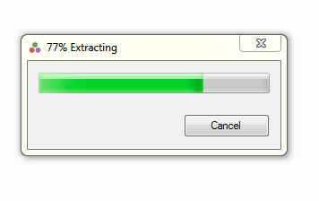

# Tutorial de instalação da linguagem de programação Julia :computer:

Olá a todas e a todos! Sejam bem vindas e bem vindos :heart:! Este é um tutorial de instalação da linguagem de programação Julia! Se você chegou até aqui, segure em nossas mãos e bora deixar nossa máquina pronta para o trabalho!

Neste tutorial veremos como instalar a versão mais recente de Julia (compatível com os nossos computadores) e daremos os primeiros passos no mundo da programação! Estão prontas e prontos para o desafio?

<!-- TOC depthFrom:2 depthTo:6 withLinks:1 updateOnSave:1 orderedList:0 -->

- [Acessando o site oficial da linguagem Julia](#acessando-o-site-oficial-da-linguagem-julia)
- [Identificando a arquitetura do nosso sistema operacional](#identificando-a-arquitetura-do-nosso-sistema-operacional)
- [Baixando a versão ideal para o nosso sistema operacional](#baixando-a-verso-ideal-para-o-nosso-sistema-operacional)
- [Instalando Julia](#instalando-julia)
- [Instalando JuliaPro (leia-se: Julia com super-poderes!)](#instalando-juliapro-leia-se-julia-com-super-poderes)

<!-- /TOC -->

## Acessando o site oficial da linguagem Julia

Antes de tudo, vamos acessar o site da linguagem Julia! Abra sua navegador preferido e digite:

```
julialang.org
```

Se preferir, simplesmente clique :point_right: [aqui](https://julialang.org/).

Você verá isso:


Antes de instalarmos qualquer coisa, vamos conferir a arquitetura do nosso sistema operacional!

## Identificando a arquitetura do nosso sistema operacional

<!--
@todo : A instalação no Windows 7 necessita de pacotes adicionais
@body : Ver pacote necessários na página de downloads de Julia
Comando para descobrir qual é a versão do Windows pelo terminal:
- https://www.windows-commandline.com/find-windows-os-version-from-command/

-->

Nesse passo, vamos descobrir qual é a arquitetura utilizada pelo nosso sistema operacional. Antes de tudo, estamos assumindo que você utiliza o sistema operacional Windows. Para instalar Julia em outros sistemas operacionais, por favor, procure os instrutores/monitores pessoalmente ou pelo nosso canal no [Slack](http://julia-diversity-ptbr.slack.com).

Já que vamos entrar no mundo da programação, que tal arriscarmos alguns comandos no terminal (aquela tela com fundo preto que os *hackers* utilizam)? Vem com a gente!

Na barra de busca do Windows, busque por **prompt de comando**. Você deve ver isso:


Já me sinto um *hacker*!

Certo! Agora vamos logo descobrir qual é a arquitetura do nosso sistema! Digite os seguintes comandos<sup name="a1">[1](#f1)</sup> no terminal:

```
wmic OS get OSArchitecture
```

Se o seu sistema utiliza a arquitetura de 32-bit, você verá:

```
OSArchitecture
32-bit
```

Caso contrário, você verá:

```
OSArchitecture
64-bit
```

Agora, vamos descobrir qual é a versão do nosso sistema operacional. Digite isso no terminal:

```
wmic os get Caption,CSDVersion /value
```

Você deve ver algo parecido com isso (se sua versão do Windows for a 7<sup name="a2">[2](#f2)</sup>):

```
Caption=Microsoft Windows 7 Enterprise
CSDVersion=Service Pack 1
```

Precisamos dessas duas informações para instalar Julia em nosso computador! Vamos voltar à página de Julia lá no nosso navegador.

## Baixando a versão ideal para o nosso sistema operacional

Voltando à página de Julia!

A opção para download estará disponível logo na página inicial. Mas vamos instalar a versão de Julia ideal para o nosso computador. Clique na aba de [Download](https://julialang.org/downloads/), fica ali ao lado da logo Julia.

Estamos nesta página agora, certo?


Descobrimos a arquitetura do nosso sistema no passo anterior, agora vamos procurar qual é o instalador ideal para nosso computador. Tudo o que você precisa é clicar no link do instalador ideal para o seu computador e o download será iniciado automaticamente.

<!--
```bash
for i in {01..17..1}
do
  echo -e "! [ ] (src / $i.png )"
done
```
-->

## Instalando Julia

Agora que o arquivo de Julia está em nosso computador, precisamos apenas executá-lo! Simples assim! Se tudo der certo, você verá as janelas habituais para a instalação da maioria dos programas. Vamos juntos, passo a passo.


Execute!


Aguarde!



Nossa sugestão é que você mantenha o local padrão de instalação que o próprio instalador fornece. Geralmente, em `C:\`. Clique em *Install*.


Aguarde mais um pouco...


Estamos próximos do fim. Nossa sugestão é que você marque as duas últimas caixinhas: *Create Start Menu Folder and shortcut* e *Create desktop shortcut*.


Se formos até nossa área de trabalho, veremos o atalho de Julia. São essas três simpáticas bolinhas coloridas. Bora testar!? Dê dois cliques aí no atalho.


Se tudo deu certo, você vai ver a tela do terminal ~~hacker~~! Com isso, nosso computador está pronto para o trabalho. Você pode testar uma operação de soma, por exemplo. Digite `2+2` e pressione Enter. Se o resultado aparecer, então realmente está tudo certo! Repare também que essa tela inicial oferece algumas informações que podem ser importantes. Por exemplo, ela fornece o endereço no qual encontramos a
<!-- @todo Inserir nota de rodapé explicando o que a documentação --> 
documentação de Julia. Além disso, podemos encontrar algumas informações de ajuda se digitarmos `?` ou `]?`. Mas essa tela parece pouco sedutora, e seria muito mais interessante se tivéssemos um programa integrado que pudesse acessar essas informações, que nos permitisse escrever e testar nosso código linha a linha. Foi pensando em resolver esse o problema de ~~sedução~~ integração (e muitos outros, na verdade) que a comunidade que criou Julia desenvolveu uma outra interface! Se você quer instalar esse programa - e recomendamos fortemente que você faça isso -, continue o tutorial. Nós vamos colocar algumas armaduras em Julia!


## Instalando JuliaPro (leia-se: Julia com super-poderes!)

O processo de instalação de JuliaPro é muito similar ao da instalação de Julia em si. Precisamos nos atentar a poucos detalhes. Vamos nessa!?

O primeiro passo aqui é acessar o site do JuliaPro. Volte ao seu navegador e navegue até:

```
https://juliacomputing.com/
```

Ou, clique [aqui](https://juliacomputing.com/).

A comunidade de Julia desenvolveu diferentes soluções. Tem para todos os gostos. Aqui, nós vamos utilizar a solução JuliaPro! Para baixá-la, clique no botão de download.


Seremos levados à página de download. Escolha o sistema operacional e clique em download. Isso nos levará para uma página de registro.


Escolha a forma que você prefere para fazer o registro. Você receberá um email de confirmação de registro. Aceite e volte à página de download.


Use seu usuário e senha aqui. O download do JuliaPro deve iniciar instantaneamente. Aguardemos :coffee:!


Se o download foi bem sucedido, encontraremos o instalador de JuliaPro na pasta de download, ou em qualquer outra pasta que você tenha escolhido para armazená-lo. Achou o seu?


ATENÇÃO:heavy_exclamation_mark::heavy_exclamation_mark::heavy_exclamation_mark:

O detalhe está aqui! Nós precisamos executar este instalador como administrador. Então, clique com o botão direito sobre o instalador de JuliaPro e o execute como administrador.


Aguardemos...


Se tudo der certo, veremos este atalho na área de trabalho. O clímax é agora... Prepare-se e dê dois cliques aí nesse atalho!


Durante esta etapa, que ocorre apenas no primeiro, todas as funcionalidades de JuliaPro serão instaladas e devidamente configuradas.

Aguardemos :coffee: ~~quantos já bebemos!?~~!


E se tudo deu certo... :tada: :tada: :tada:

Este aí é o JuliaPro! Na nossa opinião, essa tela é mais bonita que o terminal :heart_eyes:. O que você acha? Tem tanta funcionalidade aí que merece um tutorial à parte.


Por hora, é isso! ~~ufa ainda bem que acabou eu não aguentava mais credo~~ Durante o curso exploraremos todas as funcionalidades de JuliaPro. Nos vemos em breve!

:kissing_heart: :kissing_heart: :kissing_heart:

<!-- @todo : Incluir tutorial de instalação do JuliaPro -->
<!-- @body : Ver em: https://juliacomputing.com/products/juliapro#t01 -->


-----------------------------------------------------------------

<!-- FOOT NOTES -->

<b id="f1">1</b>*Nós não precisamos entender minunciosamente todos esses comandos, tudo bem? Isso ainda não faz parte do curso. Na realidade, em programação temos a oportunidade de nos transformar em super-heroínas e em super-heróis! Munidos de um computador com acesso à internet, temos acesso a dois dos maiores super-poderes dos programadores. Estão curiosas e curiosos? Vocês têm certeza que querem saber isso? É uma grande revelação... Estamos apreensivos... Os super-poderes são: `Ctrl+C` e `Ctrl+V`! É isso! Fizemos isso também, veja :point_right: [aqui](https://www.google.com/search?q=como+descobrir+arquitetura+windows+pelo+terminal&oq=como+descobrir+arquitetura+windows+pelo+terminal&aqs=chrome..69i57.18764j0j1&sourceid=chrome&ie=UTF-8). Simplesmente perguntamos para o [grande oráculo](https://www.google.com.br/) e ele prontamente nos respondeu!*[↩](#a1)

<b id="f2">2</b>*Se a versão do seu Windows é a 7, por favor, procure os instrutores/monitores. É bem provavél que precisemos dar mais alguns super-poderes à sua máquina*[↩](#a2)
